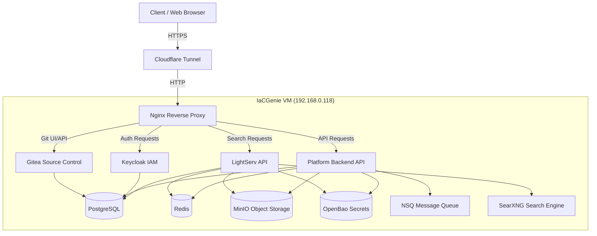

# IaCGenie Platform Infrastructure

Welcome to the IaCGenie Platform Infrastructure repository. This directory (`infra/`) contains all the necessary configuration, Ansible playbooks, and Docker Compose files to provision and manage the platform's microservices and supporting infrastructure.

## 🏗 Architecture Overview

The IaCGenie platform relies on a robust, containerized microservices architecture. It securely routes external traffic through Cloudflare Tunnels, balances load using Nginx, and manages state, authentication, and secrets using best-in-class open-source tools.

### Architecture Diagram



## 🧩 Core Components & Services

The platform consists of several core foundational services and application services:

### 1. Data & State Management
- **PostgreSQL**: The primary relational database used by the Backend, LightServ, Keycloak, and Gitea.
- **Redis**: Used for caching, session management, and ephemeral state.
- **MinIO**: S3-compatible object storage for artifacts, avatars, and file uploads.
- **NSQ**: High-performance distributed messaging platform for asynchronous task processing.

### 2. Security & Identity
- **OpenBao** (Vault fork): Centralized secrets management. All services fetch their configuration secrets dynamically from OpenBao at runtime.
- **Keycloak**: Identity and Access Management (IAM) provider handling user authentication, OIDC, and SSO.

### 3. Application Services
- **Platform Backend**: The core Python-based backend for IaCGenie.
- **LightServ API**: The Node.js/TypeScript backend for LightSerp search and intelligent query handling.
- **SearXNG**: Privacy-respecting, hackable metasearch engine utilized by LightServ.
- **Gitea**: Lightweight, self-hosted Git service for managing infrastructure-as-code repositories.

### 4. Networking
- **Nginx**: Serves as the primary API Gateway and reverse proxy routing internal traffic.
- **Cloudflare Tunnels**: Exposes internal Nginx securely to the public internet without opening inbound firewall ports.

---

## 🚀 Deployment Guide

We use **Ansible** to orchestrate the deployment of configuration files and **Docker Compose** to manage the container lifecycles.

### Prerequisites
- SSH access to the deployment VM (e.g., `192.168.0.118`).
- `ansible` installed locally.
- `git-secret` initialized and decrypted (for Ansible Vault passwords and OpenBao unseal keys).

### Deployment Steps

1. **Decrypt Secrets** (If running locally):
   ```bash
   # Ensure your GPG key is loaded, then reveal secrets
   git secret reveal
   ```

2. **Run Ansible Playbooks**:
   Navigate to the `infra/ansible/` directory. You can deploy all services or target specific ones using tags.
   
   ```bash
   cd infra/ansible
   
   # Deploy everything
   ansible-playbook -i inventory/hosts.ini playbooks/services.yml
   
   # Deploy only specific services (e.g., postgres and openbao)
   ansible-playbook -i inventory/hosts.ini playbooks/services.yml --tags "postgres,openbao"
   ```

3. **Verify Containers**:
   Ansible automatically updates the `docker-compose-unified.yml` file and restarts the necessary containers. You can verify the status directly on the VM:
   ```bash
   ssh mkanavi@192.168.0.118
   cd ~/iacgenie-platform/infra/docker-compose
   docker compose ps
   ```

---

## 👩‍💻 Usage Guide for Developers

### No Local `.env` Files
For security reasons, **no plaintext `.env` files are used in this repository**. All secrets (database passwords, API keys, JWT secrets) are stored centrally in OpenBao.

### Developing Locally
When you run the Platform Backend or LightServ locally for development, they are configured to dynamically fetch their required secrets from OpenBao over the network.

1. Ensure you are on the VPN or the same local network as the VM.
2. Export your OpenBao authentication variables:
   ```bash
   export OPENBAO_ADDR="http://192.168.0.118:8200"
   export OPENBAO_TOKEN="your-developer-service-token"
   ```
3. Start the application normally (`npm run dev` or `python main.py`). The application's secret bootstrapper will connect to OpenBao, download the required configuration, and inject it into the environment seamlessly.

For more details on secrets, refer to the [OpenBao Secrets Skill](../.agents/skills/openbao-secrets/SKILL.md).

---

## 📚 Further Reading

- **[Admin Guide](docs/ADMIN_GUIDE.md)**: For infrastructure administrators (managing OpenBao, Backups, and CI/CD).
- **[CI/CD Guide](docs/CICD-GUIDE.md)**: Details on GitHub/Gitea Actions pipelines.
- **[Security Audit](docs/SECURITY-AUDIT-REPORT.md)**: Overview of platform security posture.
